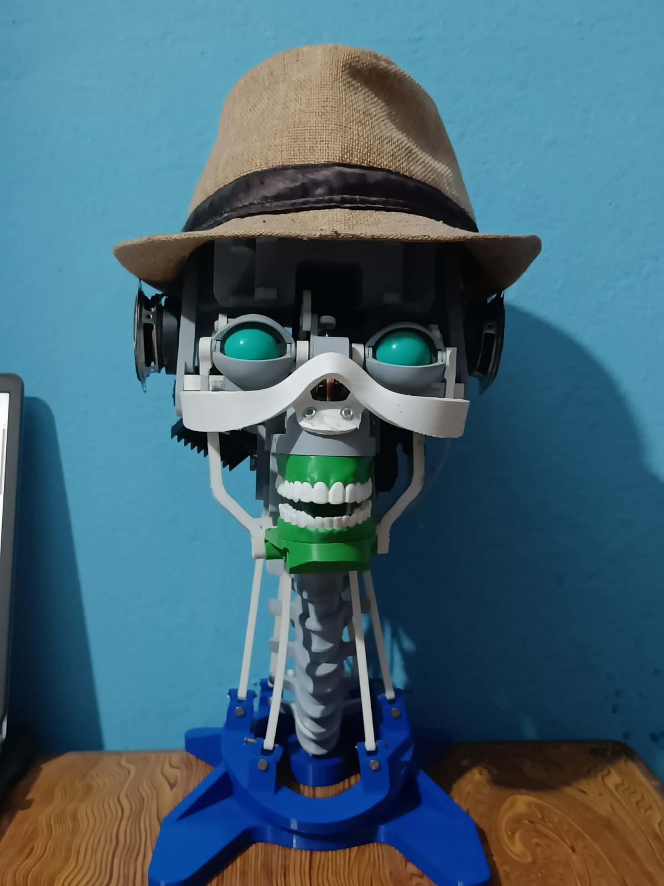

<div align="center">


<br/>

# 🤖 Brown Hat

**An open-source AI-powered humanoid robot with wake-word activation, multilingual conversation, offline/online AI, natural speech synthesis, and real-time servo-driven facial expressions — built on Raspberry Pi 4.**

<br/>

[](https://python.org)
[](https://raspberrypi.org)
[](LICENSE)
[](https://github.com/ayushshah-xo/Brown-Hat/stargazers)
[]([https://www.youtube.com/@YOUR_CHANNEL](https://youtu.be/T0bWZ5AiFkI?si=L2nQYKOcLLc1IqRG))

</div>

---

## 📖 Table of Contents

- [What is Brown Hat?](#-what-is-brown-hat)
- [Demo](#-demo)
- [Features](#-features)
- [How It Works](#-how-it-works)
- [Hardware](#-hardware)
- [Repository Structure](#-repository-structure)
- [Getting Started](#-getting-started)
- [Libraries](#-libraries)
- [Roadmap](#-roadmap)
- [Contributing](#-contributing)

---

## 🧠 What is Brown Hat?

Brown Hat is a fully functional AI-powered robotic head built from scratch — mechanical design, embedded hardware, and AI software — by a student. It wakes up when you call its name, holds a conversation in multiple languages, speaks back with a natural voice, and animates its face in real time.

No cloud subscriptions required. No black-box kits. Every part designed, printed, and coded by hand.

<br/>

<div align="center">

|  |  |  |
|:---:|:---:|:---:|
| **Built Robot** | **CAD Design** | **System Flow** |

</div>

---

## 🎥 Demo

<!-- GitHub video embed -->
https://github.com/user-attachments/assets/923eefe1-8b44-4f8e-96d7-886b42254e04

> Servo-driven facial expressions running in real time — eyes, eyebrows, and mouth animated independently.

📺 **Full walkthrough on YouTube:** [Watch here](https://www.youtube.com/@YOUR_CHANNEL)

---

## ✨ Features

| | |
|---|---|
| 🎤 **Wake-Word Activation** | Brown Hat wakes up and listens only when called — no constant mic polling |
| 🌍 **Multilingual Conversation** | Understands and responds in multiple languages |
| 🧠 **Online AI (Groq)** | Fast cloud-based responses via Groq API running Llama 3 |
| 🔌 **Offline AI (Ollama)** | Falls back to a local TinyLlama model when there's no internet |
| 🗣️ **Natural Speech Synthesis** | Text-to-speech via espeak with expressive output |
| 😐 **Facial Expressions** | Servo-driven eyes, eyebrows, and mouth synced to speech |
| 🎵 **Songs** | Can play and perform songs on command |
| ⚡ **Real-time Pipeline** | Low-latency speech-to-response with non-blocking servo animation |
| 🖨️ **3D Printed** | Every structural part is printable and fully remixable |

---

## ⚙️ How It Works

```
You say the wake word
        ↓
Wake-Word Detection  ──────  listens passively via mic
        ↓
Speech Recognition  ───────  converts your voice to text
        ↓
Language Detection  ───────  identifies input language
        ↓
AI Brain (brain/)
   ├── Online?  →  Groq API (Llama 3)
   └── Offline? →  Ollama (TinyLlama, runs on Pi)
        ↓
Text-to-Speech (voice/)  ──  synthesizes the response
        ↓
Speaker output  +  Servo animation (motion/)  ←  run in parallel
```

The servo controller runs in a separate thread so facial animation stays perfectly in sync with audio playback without blocking the AI pipeline.

---

## 🔧 Hardware

| Component | Details |
|---|---|
| **Raspberry Pi 4** | Main compute unit |
| **Servo motors ×3** | Eyes, eyebrows, mouth actuation |
| **PCA9685 servo driver** | PWM control over I²C |
| **USB microphone** | Speech input |
| **Speaker + amplifier** | Audio output |
| **5V regulated supply** | Motor power rail |
| **3D printed chassis** | Full structural frame (PLA recommended) |

---

## 📁 Repository Structure

```
Brown-Hat/
├── brain/          # AI logic — Groq (online) & Ollama (offline) integration
├── knowledge/      # Knowledge base, facts, and memory for the robot
├── motion/         # Servo control — facial expressions and animations
├── songs/          # Song playback and performance routines
├── tests/          # Unit and integration test scripts
├── voice/          # Speech recognition (input) and TTS (output)
├── robot.py        # 🚀 Main entry point — run this to start Brown Hat
├── config.py       # Hardware pins, AI model settings, language config
├── read.py         # Utility: read and parse knowledge/config files
├── requirements.txt
└── .gitignore
```

---

## 🚀 Getting Started

**Requirements:** Python 3.9+, Raspberry Pi OS 64-bit

### 1. Clone the repository

```bash
git clone https://github.com/ayushshah-xo/Brown-Hat.git
cd Brown-Hat
```

### 2. Install Python dependencies

```bash
pip install -r requirements.txt
```

### 3. Install system packages

```bash
sudo apt install espeak python3-pyaudio portaudio19-dev alsa-utils
```

### 4. Set up offline AI (optional but recommended)

```bash
curl -fsSL https://ollama.com/install.sh | sh
ollama pull tinyllama
```

> Brown Hat automatically switches between Groq (online) and Ollama (offline) — no manual intervention needed.

### 5. Configure

Open `config.py` and set your GPIO pins, Groq API key, and language preferences.

```python
# config.py — key settings
GROQ_API_KEY = "your_api_key_here"   # Get from console.groq.com
WAKE_WORD    = "brown hat"
LANGUAGE     = "en"                  # Change for multilingual mode
PAN_PIN      = 18                    # Servo GPIO pins
TILT_PIN     = 19
```

> ⚠️ Never commit your API key. Add `config.py` to `.gitignore` or use environment variables.

### 6. Run Brown Hat

```bash
python3 robot.py
```

Say the wake word and start talking!

---

## 📦 Libraries

**Python packages** — installed via pip:

| Package | Purpose |
|---|---|
| `adafruit-circuitpython-servokit` | PCA9685 servo driver control |
| `groq` | Online AI via Groq (Llama 3) |
| `SpeechRecognition` | Converts microphone audio to text |
| `pyaudio` | Raw audio stream for the mic |
| `requests` | HTTP calls to Groq and Ollama |
| `pyyaml` | Reads config and knowledge files |

```bash
pip install -r requirements.txt
```

**System packages** — installed via apt:

| Package | Purpose |
|---|---|
| `espeak` | Offline text-to-speech engine |
| `python3-pyaudio` | PyAudio system binding |
| `portaudio19-dev` | Audio I/O backend |
| `alsa-utils` | Audio device control (`aplay`, `alsamixer`) |

---

## 🤝 Contributing

Issues, pull requests, and forks are welcome.

If you improve a module or add a new feature, open a PR — this project is designed to be remixed.

1. Fork the repo
2. Create your branch: `git checkout -b feature/your-feature`
3. Commit your changes: `git commit -m "Add your feature"`
4. Push and open a PR: `git push origin feature/your-feature`

---

## 👤 Author

**Ayush Shah**
[](https://github.com/ayushshah-xo)
[]([https://www.youtube.com/@YOUR_CHANNEL](https://youtu.be/T0bWZ5AiFkI?si=L2nQYKOcLLc1IqRG))

---

<div align="center">

If this project helped or inspired you — a ⭐ goes a long way.

</div>
